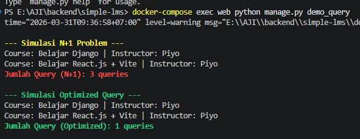

# Simple LMS (Django + Docker + PostgreSQL)

Simple LMS adalah project backend berbasis Django yang dijalankan menggunakan Docker dan PostgreSQL sebagai database.

---

##  Cara Menjalankan Project

### 1. Clone Repository

```bash
git clone https://github.com/ajimaruu/simple-lms.git
cd simple-lms
```

---

### 2. Copy Environment File

```bash
cp .env.example .env
```

Atau di Windows (PowerShell):

```powershell
copy .env.example .env
```

---

### 3. Build dan Jalankan Container

```bash
docker-compose up -d --build
```

---

### 4. Jalankan Migrasi Database

```bash
docker-compose exec web python manage.py migrate
```

---

### 5. Akses Aplikasi

Buka browser:

```
http://localhost:8000
```

---

## Environment Variables

File `.env` digunakan untuk menyimpan konfigurasi sensitif.

| Variable    | Deskripsi                                 |
| ----------- | ----------------------------------------- |
| DEBUG       | Mode development (1/0 Atau True/False)    |
| SECRET_KEY  | Secret key Django                         |
| DB_NAME     | Nama database PostgreSQL                  |
| DB_USER     | Username database                         |
| DB_PASSWORD | Password database                         |
| DB_HOST     | Host database (gunakan `db` untuk Docker) |
| DB_PORT     | Port database (default: 5432)             |

---

## 🐳 Services (Docker)

Project ini menggunakan 2 service utama:

* **web** → Django application (port 8000)
* **db** → PostgreSQL database (port 5432)

---

## Perintah Penting

```bash
# Menjalankan container
docker-compose up

# Menghentikan container
docker-compose down

# Migrasi database
docker-compose exec web python manage.py migrate

# Membuat superuser
docker-compose exec web python manage.py createsuperuser
```

## Data Models & Django Admin

Aplikasi courses pada project ini memiliki skema database berikut:

User: Custom user model dengan tambahan atribut role (Admin, Instructor, Student).

Category: Relasi self-referencing untuk mendukung hierarki kategori (parent).

Course: Berelasi dengan Instructor (User) dan Category.

Lesson: Berelasi dengan Course, dilengkapi sistem ordering.

Enrollment: Dilengkapi UniqueConstraint untuk mencegah duplikasi pendaftaran Student pada Course yang sama.

Progress: Dilengkapi UniqueConstraint untuk melacak penyelesaian materi.

Django Admin juga telah dikonfigurasi secara optimal dengan:

list_display, list_filter, dan search_fields.

TabularInline untuk menambahkan Lesson secara langsung dari dalam form pembuatan Course.


## nitial Data Fixtures
Project ini dilengkapi dengan data dummy awal (Fixtures) untuk mempermudah pengujian. Untuk memuat data ini ke dalam database yang masih kosong, jalankan perintah:
```bash
docker-compose exec web python manage.py loaddata courses/fixtures/initial_data.json
```


## Query Optimization Demo (N+1 Problem)
Project ini mengimplementasikan Custom Model Managers menggunakan select_related dan prefetch_related untuk mengatasi masalah inefisiensi N+1 Query Problem pada framework ORM.

Untuk menjalankan script pengujian perbandingan jumlah eksekusi query, gunakan perintah:
```bash
docker-compose exec web python manage.py demo_query
```

---

## Screenshot



---

## Struktur Project

```
simple-lms/
├── courses/              
│   │   └── initial_data.json
│   ├── management/
│   │   └── commands/
│   │       └── demo_query.py
│   ├── admin.py
│   └── models.py
├── config/              
│   ├── settings.py
│   ├── urls.py
│   └── wsgi.py
├── docs/                 
│   ├── screenshot.png
│   └── query_demo.png
├── docker-compose.yml
├── Dockerfile
├── .env
├── .env.example
├── requirements.txt
├── manage.py
└── README.md
```

---

## Author

Nama: Aji Bayu Seno

NIM: A11.2023.14885

Project: Simple LMS
