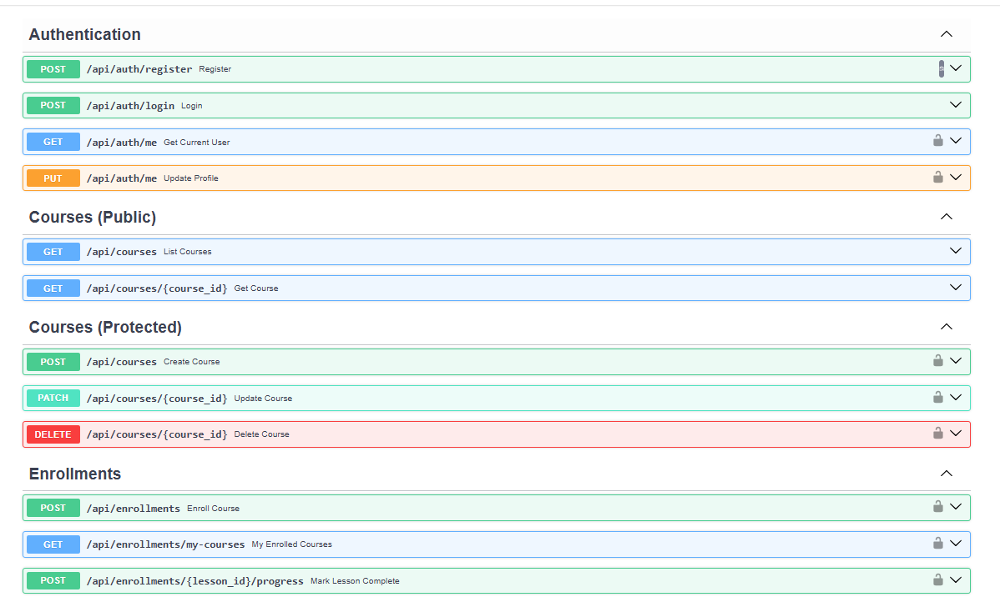

# Simple LMS (Django + Docker + PostgreSQL)

imple LMS adalah backend API untuk sistem manajemen pembelajaran yang dibangun dengan Django Ninja. Proyek ini menggunakan arsitektur modern berbasis token (JWT) dan kontrol akses berbasis peran (RBAC), dijalankan sepenuhnya menggunakan Docker.
---

## Fitur Utama

REST API dengan Django Ninja: Framework API yang cepat dan efisien dengan validasi Pydantic.

JWT Authentication: Keamanan akses menggunakan JSON Web Token (Login & Register).

Role-Based Access Control (RBAC): Pembatasan fitur untuk Admin, Instructor, dan Student menggunakan custom decorators.

Database PostgreSQL: Penyimpanan data relasional yang persisten dan tangguh.

Query Optimization: Mengatasi masalah N+1 Query menggunakan select_related dan prefetch_related.

Interactive Documentation: Swagger UI otomatis tersedia untuk pengujian API secara langsung.

##  Cara Menjalankan Project

### 1. Clone Repository

```bash
git clone https://github.com/ajimaruu/simple-lms.git
cd simple-lms
```

---

### 2. Copy Environment File

```bash
cp .env.example .env
```

Atau di Windows (PowerShell):

```powershell
copy .env.example .env
```

---

### 3. Build dan Jalankan Container

```bash
docker-compose up -d --build
```

---

### 4. Jalankan Migrasi Database

```bash
# Migrasi tabel
docker-compose exec web python manage.py migrate

# Load data awal (Admin, Instructor, Student, & Courses)
docker-compose exec web python manage.py loaddata courses/fixtures/initial_data.json
```

---

### 5. Akses Aplikasi

Buka browser:

```
http://localhost:8000
```

---

### Dokumentasi API (Swagger)
Setelah container berjalan, Anda dapat mengakses dokumentasi interaktif di:
👉 http://localhost:8000/api/docs

Endpoint Utama:

Authentication: /api/auth/register, /api/auth/login, /api/auth/me.

Courses: /api/courses (Public), /api/courses (Instructor/Admin Only).

Enrollments: /api/enrollments, /api/enrollments/my-courses, /api/enrollments/{id}/progress.

## Environment Variables

File `.env` digunakan untuk menyimpan konfigurasi sensitif.

| Variable    | Deskripsi                                 |
| ----------- | ----------------------------------------- |
| DEBUG       | Mode development (1/0 Atau True/False)    |
| SECRET_KEY  | Secret key Django                         |
| DB_NAME     | Nama database PostgreSQL                  |
| DB_USER     | Username database                         |
| DB_PASSWORD | Password database                         |
| DB_HOST     | Host database (gunakan `db` untuk Docker) |
| DB_PORT     | Port database (default: 5432)             |

---

## 🐳 Services (Docker)

Project ini menggunakan 2 service utama:

* **web** → Django application (port 8000)
* **db** → PostgreSQL database (port 5432)

---

## Perintah Penting

```bash
# Menjalankan container
docker-compose up

# Menghentikan container
docker-compose down

# Migrasi database
docker-compose exec web python manage.py migrate

# Membuat superuser
docker-compose exec web python manage.py createsuperuser
```

## Data Models & Django Admin

Aplikasi courses pada project ini memiliki skema database berikut:

User: Custom user model dengan tambahan atribut role (Admin, Instructor, Student).

Category: Relasi self-referencing untuk mendukung hierarki kategori (parent).

Course: Berelasi dengan Instructor (User) dan Category.

Lesson: Berelasi dengan Course, dilengkapi sistem ordering.

Enrollment: Dilengkapi UniqueConstraint untuk mencegah duplikasi pendaftaran Student pada Course yang sama.

Progress: Dilengkapi UniqueConstraint untuk melacak penyelesaian materi.

Django Admin juga telah dikonfigurasi secara optimal dengan:

list_display, list_filter, dan search_fields.

TabularInline untuk menambahkan Lesson secara langsung dari dalam form pembuatan Course.


## nitial Data Fixtures
Project ini dilengkapi dengan data dummy awal (Fixtures) untuk mempermudah pengujian. Untuk memuat data ini ke dalam database yang masih kosong, jalankan perintah:
```bash
docker-compose exec web python manage.py loaddata courses/fixtures/initial_data.json
```


## Query Optimization Demo (N+1 Problem)
Project ini mengimplementasikan Custom Model Managers menggunakan select_related dan prefetch_related untuk mengatasi masalah inefisiensi N+1 Query Problem pada framework ORM.

Untuk menjalankan script pengujian perbandingan jumlah eksekusi query, gunakan perintah:
```bash
docker-compose exec web python manage.py demo_query
```

---

## Screenshot





---

## Struktur Project

```
simple-lms/
├── courses/              
│   ├── fixtures/          # Data dummy JSON
│   ├── management/        # Custom django commands
│   ├── api.py             # Routing Django Ninja
│   ├── auth.py            # Logic JWT Authentication
│   ├── permissions.py     # Decorators RBAC
│   ├── schemas.py         # Pydantic Validation
│   └── models.py          # Database Schema
├── config/                # Django settings & URL config
├── docs/                  # Screenshots & Dokumentasi
├── docker-compose.yml
└── Dockerfile
```

---

## Author

Nama: Aji Bayu Seno

NIM: A11.2023.14885

Project: Simple LMS
