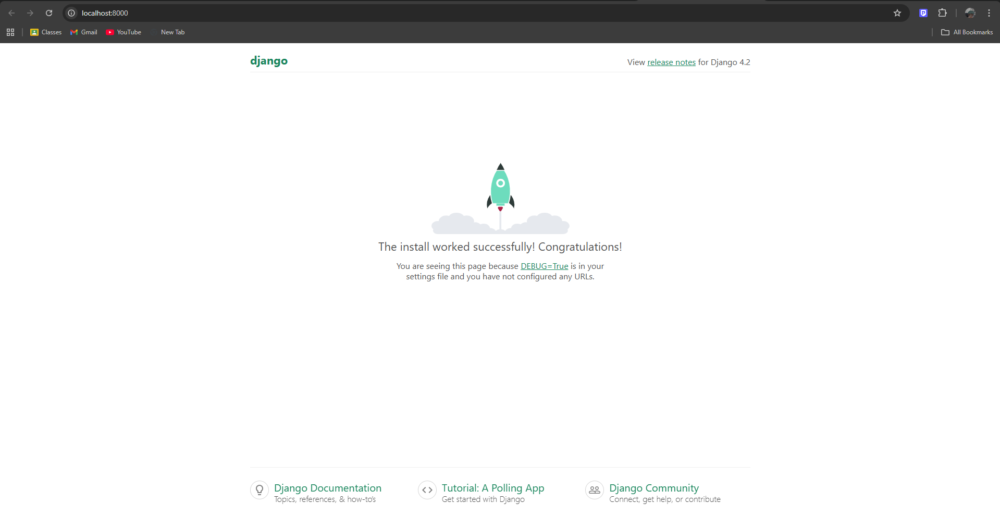

# Simple LMS (Django + Docker + PostgreSQL)

Simple LMS adalah project backend berbasis Django yang dijalankan menggunakan Docker dan PostgreSQL sebagai database.

---

##  Cara Menjalankan Project

### 1. Clone Repository

```bash
git clone https://github.com/ajimaruu/simple-lms.git
cd simple-lms
```

---

### 2. Copy Environment File

```bash
cp .env.example .env
```

Atau di Windows (PowerShell):

```powershell
copy .env.example .env
```

---

### 3. Build dan Jalankan Container

```bash
docker-compose up -d --build
```

---

### 4. Jalankan Migrasi Database

```bash
docker-compose exec web python manage.py migrate
```

---

### 5. Akses Aplikasi

Buka browser:

```
http://localhost:8000
```

---

## Environment Variables

File `.env` digunakan untuk menyimpan konfigurasi sensitif.

| Variable    | Deskripsi                                 |
| ----------- | ----------------------------------------- |
| DEBUG       | Mode development (True/False)             |
| SECRET_KEY  | Secret key Django                         |
| DB_NAME     | Nama database PostgreSQL                  |
| DB_USER     | Username database                         |
| DB_PASSWORD | Password database                         |
| DB_HOST     | Host database (gunakan `db` untuk Docker) |
| DB_PORT     | Port database (default: 5432)             |

---

## 🐳 Services (Docker)

Project ini menggunakan 2 service utama:

* **web** → Django application (port 8000)
* **db** → PostgreSQL database (port 5432)

---

## Perintah Penting

```bash
# Menjalankan container
docker-compose up

# Menghentikan container
docker-compose down

# Migrasi database
docker-compose exec web python manage.py migrate

# Membuat superuser
docker-compose exec web python manage.py createsuperuser
```

---

## Screenshot

---

## Struktur Project

```
simple-lms/
├── docker-compose.yml
├── Dockerfile
├── .env
├── .env.example
├── requirements.txt
├── manage.py
├── config/
│   ├── settings.py
│   ├── urls.py
│   └── wsgi.py
└── README.md
```

---

## Author

Nama: Aji Bayu Seno

NIM: A11.2023.14885

Project: Simple LMS
